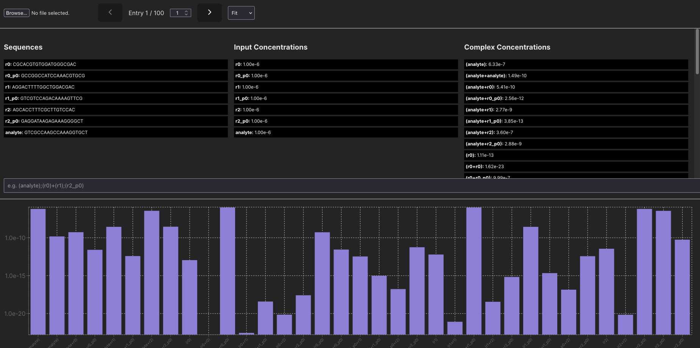
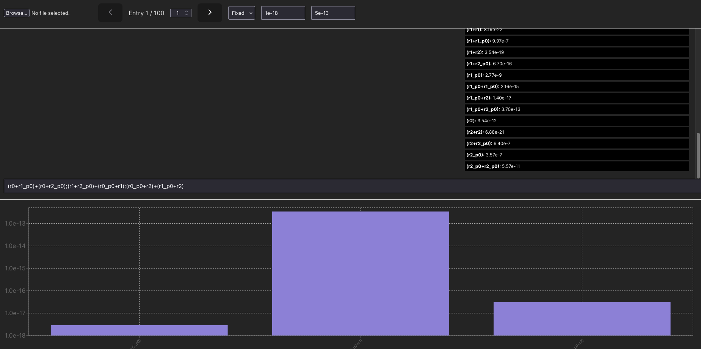

# dna-complex-dashboard

A React/Vite local browser app for visualizing DNA strand complexes and their equilibrium concentrations. This tool parses structured JSON data—typically from tools like NUPACK—and displays interactive bar graphs and sequence information to help quickly visualize output DNA complexes.

## Installation

Requires node package manager.

After cloning the repository,

`npm install`

`npm run dev`

The default local address: `http://localhost:5173/`

## Examples

### Viewing all complexes

### Viewing selected complexes (and combinations) with custom range

After selecting the desired complexes, the nav bar can cycle through each complex to get a quick visual overview of how each system differs.